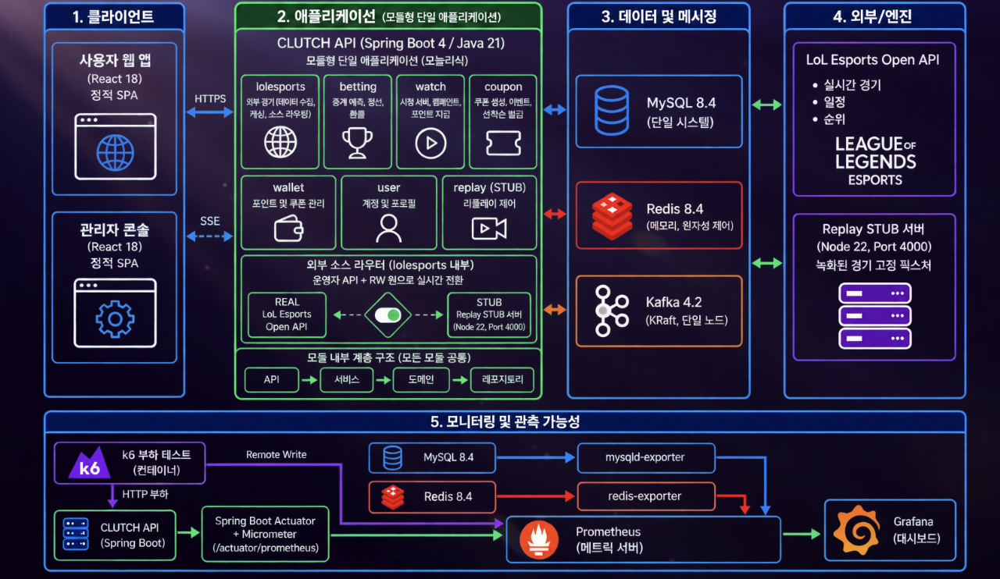
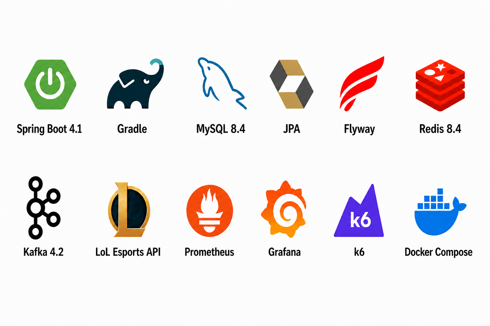

# CLUTCH Backend


**LoL Esports 경기 경험과 대규모 트래픽 선착순 쿠폰 발급을 연결한 Spring Boot 백엔드**

## 목차

1. [프로젝트 소개](#1-프로젝트-소개)
2. [시스템 아키텍처](#2-시스템-아키텍처)
3. [사용 기술](#3-사용-기술)
4. [핵심 기능 소개](#4-핵심-기능-소개)
5. [테스트 및 검증 결과](#5-테스트-및-검증-결과)
6. [트러블슈팅](#6-트러블슈팅)
7. [협업 컨벤션](#7-협업-컨벤션)
8. [로컬 실행 방법](#8-로컬-실행-방법)

## 1. 프로젝트 소개

### 주제

**대규모 트래픽 환경에서도 정합성을 보장하는 선착순 쿠폰 발급 시스템**을 중심으로, LoL Esports 경기 시청 보상과 세트 승패 예측 경험을 구현합니다.

- 재고 10,000장에 고유 사용자 20,000명이 동시에 접근하는 상황을 재현합니다.
- 한 사용자에게 동일 발급 회차의 쿠폰이 중복 발급되지 않도록 제어합니다.
- 외부 경기 데이터의 지연·변동을 고려해 배팅, 포인트, 쿠폰 이벤트가 일관된 상태를 사용하도록 설계합니다.
- 쿠폰 이력·재고·상태 전이를 대량 데이터 기준으로 검증할 수 있는 수단을 제공합니다.

### 조원 및 담당 기능

| 조원 |
|---|
| 석종수 · 안제홍 · 김재우 · 전민규 · 김현정 · 최민혁 |

| 담당 영역 | 주요 내용 |
|---|---|
| LoL Esports 피드 | 일정·순위·라이브 경기·세트 통계 수집, 적재와 화면용 조회 API |
| 시청·포인트 | 단일 활성 시청 세션, 유효 시간 누적과 포인트 수령 |
| 세트 승패 예측 | 배팅 이벤트 생성·마감, 포인트 차감, 정산과 환불 |
| 쿠폰·지갑 | 트리거 기반 쿠폰 이벤트, 선착순 발급, 사용자 쿠폰과 발급 이력 관리 |
| 관리자 운영 | 쿠폰 종류·이벤트 관리, 발급 이력 조회, 개인정보 마스킹 |
| 관측·검증 | 모니터링 대시보드, 대규모 부하 테스트와 정합성 검증 환경 |

## 2. 시스템 아키텍처



CLUTCH API는 도메인별로 책임을 나눈 하나의 Spring Boot 애플리케이션입니다. 사용자 웹과 관리자 콘솔은 REST/JSON API를 호출하고, 쿠폰 재고처럼 즉시 전달이 필요한 변경은 SSE로 전달합니다.

| 구성 요소 | 역할 |
|---|---|
| CLUTCH API | 경기·배팅·시청·쿠폰·지갑·사용자·Replay 제어 유스케이스 처리 |
| MySQL 8.4 | 사용자, 경기, 포인트, 쿠폰, Outbox를 저장하는 최종 기준 저장소 |
| Redis 8.4 | Spring Session, 쿠폰 재고·중복 발급, 시청 세션의 원자적 상태 제어 |
| Kafka 4.2 | 쿠폰 발급 결과 등 요청과 분리할 수 있는 후속 이벤트 전달 |
| LoL Esports Open API | 실제 경기 일정, 순위, 라이브 경기와 결과 데이터 제공 |
|  |
| Prometheus · Grafana · k6 | 애플리케이션과 저장소 지표 수집, 대시보드, 부하 테스트 |

외부 경기 소스는 운영자 API를 통해 `REAL`과 `STUB` 중 하나로 전환합니다. 전환 시 캐시·폴링 상태를 초기화해 서로 다른 소스의 프레임이 섞이지 않도록 합니다.

## 3. 사용 기술



## 4. 핵심 기능 소개

### 실시간 LoL Esports 경기 데이터

- 외부 API를 폴링해 일정, 순위, 라이브 경기, 세트별 팀·선수 지표와 타임라인을 수집합니다.
- 외부 상태 값 지연을 고려해 세트 종료와 세트 승자 확정을 분리하고, 확정된 `gameWins`만 승자 판정에 사용합니다.
- 펜타킬·퍼스트 블러드 같은 경기 사건을 감지해 쿠폰 이벤트를 열 수 있습니다.

### 트리거 기반 선착순 쿠폰

- 경기와 트리거 조건에 쿠폰 이벤트를 연결하고, 단일·단계형 선착순 발급 정책을 관리합니다.2
- Redis Lua script로 재고와 사용자 중복을 원자적으로 확인한 뒤, MySQL transaction에서 발급 요청·사용자 쿠폰·Outbox를 함께 저장합니다.
- Redis 상태를 신뢰할 수 없는 경우 MySQL의 실제 발급 결과를 기준으로 재고를 복구합니다.

### 포인트 및 승패 예측

- 유효 시청 시간 5분마다 사용자가 직접 수령하면 100포인트를 지급하며, 수령 전에는 추가 적립하지 않습니다.
- 사용자는 1,000~100,000포인트 범위에서 한 세트에 한 번만 배팅할 수 있으며, 배팅 시 포인트를 즉시 차감합니다.
- 정산 시 총 배팅액과 적중자의 배팅 비율에 따라 배분합니다.
- 진행되지 않은 세트는 이벤트를 취소하고 배팅 포인트를 환불합니다.

### 관리자 쿠폰 운영

- 쿠폰 종류와 이벤트의 등록·조회·수정·삭제를 제공합니다.
- 이벤트·사용자·상태·기간을 조합해 발급 이력을 커서 기반으로 조회합니다.
- 관리자 응답에서도 이름·이메일·전화번호를 마스킹하고, 이력이 있는 발급 정책의 임의 변경·삭제를 제한합니다.

## 5. 테스트 및 검증 결과

### 쿠폰 20,000 VU Ramp 테스트

재고 10,000장, 고유 사용자 20,000명, 60초 ramp-up 조건에서 네이티브 k6로 선착순 쿠폰 발급 API를 검증했습니다.

| 항목 | 결과 |
|---|---:|
| 신청 시도 | 20,000건 |
| 발급 성공 | 10,000건 |
| 정상 품절 | 10,000건 |
| 전송 실패·예상하지 못한 응답 | 0건 |
| 최대 활성 VU | 20,000 |
| Claim p95 | 951.19ms |
| 최종 판정 | PASS |

### 정합성과 도메인 검증

- 100만 사용자와 300만 건 이상 발급 요청 이력을 대상으로, 참조 관계·중복 발급·재고 초과·상태 전이를 읽기 전용 SQL로 검증합니다.
- 쿠폰 이벤트 CRUD, 시청 세션, 배팅 등록·정산·환불은 도메인·서비스·API·통합 테스트로 검증합니다.
- 이벤트 감지기는 기록된 경기 데이터를 사용해 누락을 확인합니다.

상세 조건과 결과는 [쿠폰 부하 테스트 보고서](docs/07-verification/results/2026-08-30-coupon-20000-vu-load-test.md), [대량 데이터 정합성 검증](docs/07-verification/README.md)에서 확인할 수 있습니다.

## 6. 트러블슈팅

### 1. 쿠폰 발급 부하에서의 행 잠금과 HikariCP 대기

**문제 현상**

부하가 증가할수록 요청 처리가 지연됐고, Grafana에서 MySQL 행 잠금과 HikariCP pending이 함께 증가했습니다.

**원인 분석 과정**

- 여러 요청이 하나의 공통 행에 집중되면서 행 잠금 병목이 발생하는 것을 확인했습니다.
- 관측 결과를 쿠폰 담당자에게 전달하고 코드 흐름과 지표를 함께 확인하면서, 성공 수량을 갱신하는 공통 행이 hot row라는 점을 파악했습니다.
- 공통 행 갱신을 제거한 뒤 행 잠금 문제는 줄었지만, 기본 DB 풀 크기 10에서는 HikariCP pending이 최대 약 180까지 증가했습니다.

**해결 방법**

- 쿠폰 발급 트랜잭션에서 공통 성공 수량 행 갱신을 제거하고, 실제 `user_coupon`을 기준으로 성공 수량을 별도 집계했습니다.
- Redis 선판단으로 품절·중복 요청이 DB 트랜잭션에 진입하지 않도록 했습니다.
- 부하 테스트 환경의 HikariCP 풀 크기를 20, 50, 100, 150으로 단계적으로 조정해 pending 지표를 비교했고, 100을 해당 환경의 설정값으로 결정했습니다.

**검증 결과**

- 같은 시나리오에서 행 잠금 개선 전후를 비교했습니다.
- 풀 크기를 높일수록 HikariCP pending이 감소했고, 풀 크기 100에서 대기가 거의 발생하지 않았습니다.

### 2. 관리자 발급 내역 조회 성능과 개인정보 노출

**문제 현상**

발급 내역을 여러 테이블과 한 번에 조인하면 대량 데이터에서 전체 조인과 정렬이 발생할 수 있었고, 관리자 응답에 회원 개인정보 원문이 노출될 가능성도 있었습니다.

**원인 분석**

조회 대상 페이지를 제한하기 전에 상세 테이블을 조인한 구조와 별도의 개인정보 응답 정책이 없었던 것이 원인이었습니다.

**해결 방법**

- 발급 요청 ID를 먼저 조회한 뒤 상세 정보를 조인하는 2단계 조회로 변경했습니다.
- 필터에 필요한 테이블만 동적으로 조인하고, 이벤트·사용자·기간 조회용 복합 인덱스를 추가했습니다.
- 이름·이메일·전화번호 마스킹 컴포넌트를 적용하고 `User.toString()`에서 개인정보를 제외했습니다.

**검증 결과**

필터가 없는 조회는 `PRIMARY` 인덱스를 역순으로 읽고 21건으로 제한되는 실행 계획을 확인했습니다. 동적 조인 테스트와 개인정보 마스킹 테스트도 통과했습니다.

### 3. 외부 경기 피드의 지연된 종료 상태

**문제 현상**

외부 소스는 경기가 끝난 뒤에도 한동안 `inProgress` 상태를 유지했습니다. 세트 승패가 확정된 뒤에도 라이브 목록에 남아 화면이 밴픽·대기 상태처럼 보이는 문제가 발생했습니다.

**원인 분석**

외부 소스의 매치 상태는 실제 진행보다 늦게 갱신됐고, 활성 세트 정보가 사라지는 것만으로는 세트 사이 대기 구간과 매치 종료를 구분할 수 없었습니다.

**해결 방법**

- 피드의 종료 신호는 세트 종료 표시에 사용했습니다.
- 팀별 세트 승수가 증가한 시점에만 세트 승자와 스코어를 확정했습니다.
- 어느 팀이든 다전제 과반 승수에 도달하면 외부 매치 상태와 관계없이 매치를 종료 처리했습니다.

**검증 결과**

세트 종료 여부, 승자, 매치 종료 여부와 최종 승리 팀을 API 응답에 분리해 노출했습니다.

### 4. 시청 세션에서 중복·역순 heartbeat와 포인트 수령 경합

**문제 현상**

네트워크 재시도·복수 탭·늦게 도착한 요청으로 heartbeat가 중복 또는 역순으로 처리되면 시청 시간이 과다 누적될 수 있습니다. 수령 버튼의 동시 요청은 같은 5분 보상을 중복 지급할 위험도 있습니다.

**원인 분석**

고빈도 시청 상태는 Redis에, 실제 포인트와 거래 이력은 MySQL에 저장되므로 두 저장소를 하나의 트랜잭션으로 묶을 수 없습니다. 사용자별 최신 세션과 heartbeat 순번을 검증하지 않으면 이전 세션 요청도 정상 처리될 수 있습니다.

**해결 방법**

- Redis Lua Script에서 활성 세션·최신 `sessionKey`·heartbeat 순번·서버 수신 시각 간격을 한 번에 검증했습니다.
- 한 heartbeat에서 최대 60초만 인정하고, 실제 세트가 진행 중일 때만 시간을 누적했습니다.
- 수령 시에는 사용자별 전환 lock, MySQL 사용자 행 잠금, `(watch_session_id, reward_sequence)` 유니크 제약을 함께 적용했습니다.
- Redis 완료 처리 전 재시도된 요청은 기존 포인트 거래를 반환해 중복 지급하지 않도록 했습니다.

**검증 결과**

중복·이전 순번 heartbeat가 누적되지 않고, 같은 세션·회차의 동시 수령 요청에서도 포인트 100p와 거래 1건만 남는 것을 확인했습니다.

## 7. 협업 컨벤션

### Jira 작업 관리와 브랜치 자동화

Jira 이슈 하나를 하나의 Pull Request 단위로 관리합니다. `Task`를 만들 때 `backend` 라벨과 작업 타입 라벨 하나를 함께 지정하면, `dev` 기준 작업 브랜치가 자동으로 생성됩니다.

```text
Jira Task 생성
→ backend + feat/refactor/chore/docs 라벨 지정
→ dev 기준 작업 브랜치 자동 생성
→ branch-created 라벨 추가
→ 개발 · PR · 리뷰 · Squash and merge
```

| Jira 업무 유형 | 생성 조건 | 자동 생성 브랜치 |
|---|---|---|
| `Task` | `backend` + `feat` | `feat/CLUTCH-123` |
| `Task` | `backend` + `refactor`/`chore`/`docs` 중 하나 | 해당 타입의 브랜치  |

- Task에는 작업 타입 라벨을 정확히 하나만 설정합니다.
- 라벨은 이슈를 만든 뒤가 아니라 **생성 화면에서** 지정해야 자동화가 동작합니다.
- 자동화가 완료되면 붙는 `branch-created` 라벨은 직접 추가하거나 삭제하지 않습니다.

### 브랜치 전략

```text
main              시연 가능한 안정 브랜치
└── dev           개발 통합 브랜치
    └── <type>/CLUTCH-<issue>
```

- `main`과 `dev`에는 직접 push하지 않습니다.
- Jira 이슈 하나당 `dev` 기준 작업 브랜치 하나를 생성합니다.
- 브랜치는 설명 suffix 없이 `<type>/CLUTCH-<issue>` 형식을 사용합니다.

| 타입 | 용도 | 예시 |
|---|---|---|
| `feat` | 기능 개발 | `feat/CLUTCH-112` |
| `fix` | 버그 수정 | `fix/CLUTCH-64` |
| `refactor` | 기능 변화 없는 개선 | `refactor/CLUTCH-49` |
| `chore` | 빌드·환경·설정 작업 | `chore/CLUTCH-62` |
| `docs` | 문서 작업 | `docs/CLUTCH-120` |

### 커밋 메시지

Conventional Commits 형식을 사용하며, 제목은 한글 명령형으로 작성합니다.

```text
<type>: <제목>
<type>(<domain>): <제목>

feat(betting): 세트 승패 예측 등록 API 구현
fix(coupon): 중복 발급 검증 오류 수정
docs: README 프로젝트 소개 업데이트
```

- 제목은 50자 이내를 권장하고 마침표를 붙이지 않습니다.
- 하나의 커밋에는 하나의 목적만 포함합니다.

### Pull Request

```text
<type>:[CLUTCH-<issue>] <작업 내용>

feat:[CLUTCH-21] 쿠폰 발급 API 구현
```

- Pull Request 대상은 항상 `dev`입니다.
- Backend CI 성공과 1명 이상의 승인 후 Squash and merge 합니다.
- 개인용 `application.yaml`, `.env`, 비밀값은 커밋하지 않습니다.

### 코드·문서 규칙

- Controller는 요청 검증·서비스 호출·HTTP 응답만 담당하고, 비즈니스 판단은 Service에 둡니다.
- Entity를 API 응답으로 직접 반환하지 않고 DTO를 사용합니다.
- DB 스키마 변경은 Flyway migration으로 관리하며 날짜·시각은 UTC로 처리합니다.
- 텍스트 파일은 UTF-8과 기본 CRLF를 사용하고, 구현에 영향을 주는 결정은 관련 `docs/` 문서를 함께 갱신합니다.

전체 기준은 [Git 컨벤션](docs/04-conventions/git-convention.md), [Jira–GitHub 워크플로](docs/04-conventions/jira-github-workflow.md), [개발 가이드](AGENTS.md)를 따릅니다.

## 8. 로컬 실행 방법

### 사전 준비

- JDK 21
- Docker Desktop 또는 Docker Engine
- Docker Compose v2

### 인프라는 Docker, 애플리케이션은 로컬에서 실행

```bash
# 1. 개인 로컬 설정 생성 (최초 1회)
cp src/main/resources/application.example.yaml src/main/resources/application.yaml

# 2. 로컬 인프라 실행
docker compose up -d --wait

# 3. Spring Boot 애플리케이션 실행
./gradlew bootRun

# 4. 상태 확인
curl http://localhost:8080/actuator/health
```

### 애플리케이션까지 Docker에서 실행

```bash
docker compose --profile app up -d --build --wait
curl http://localhost:8080/actuator/health
```

| 서비스 | 주소 |
|---|---|
| Spring Boot API | `http://localhost:8080` |
| MySQL | `localhost:3306` |
| Redis | `localhost:6379` |
| Kafka | `localhost:9092` |
