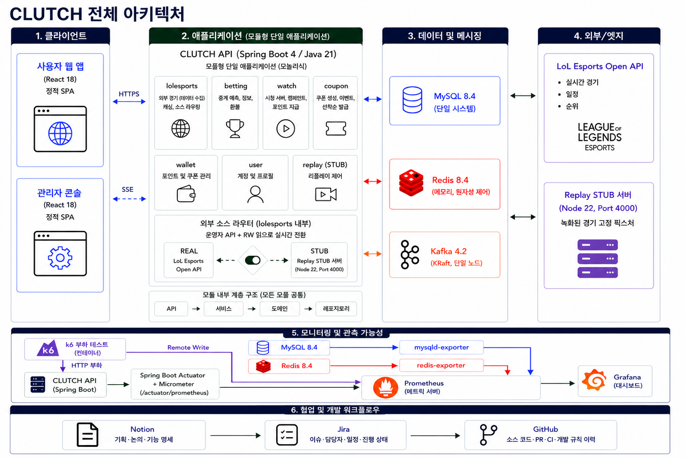
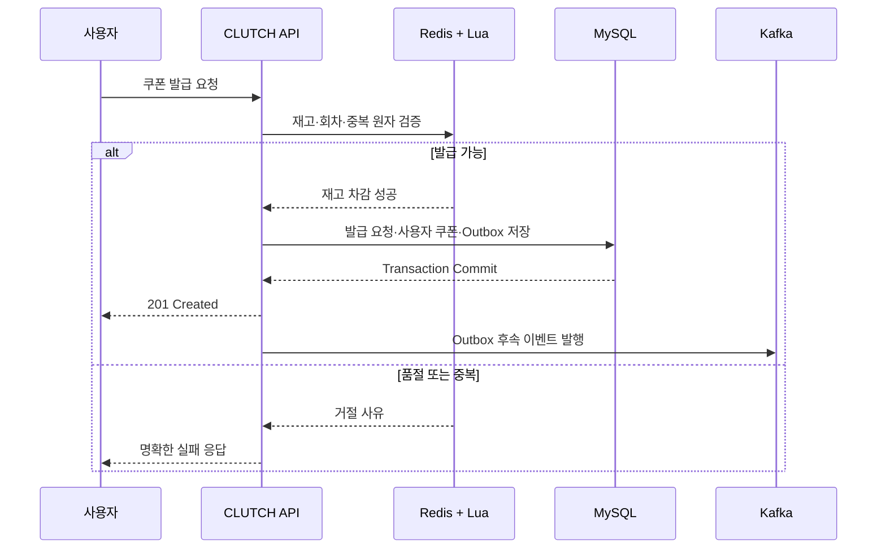
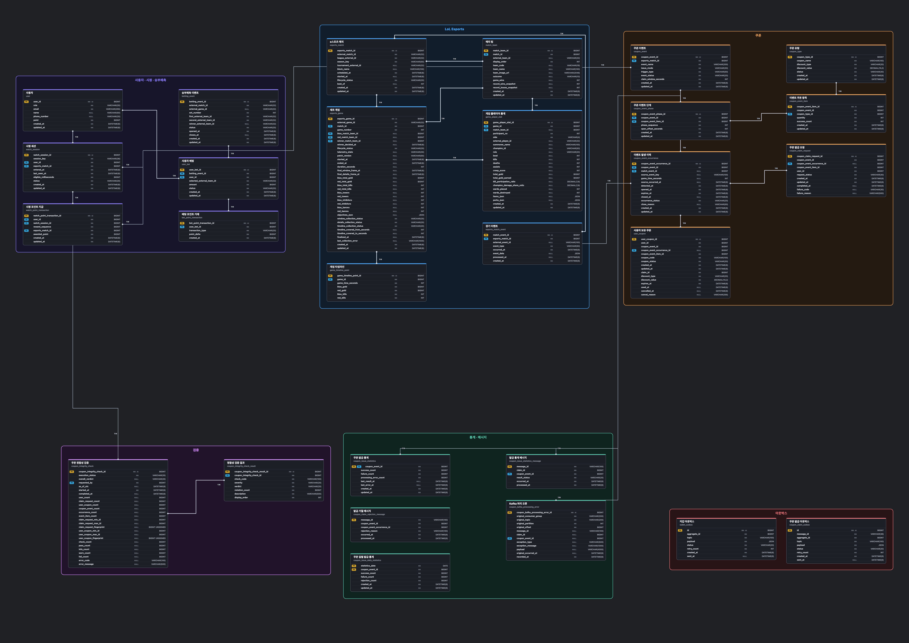

# CLUTCH

> 대규모 트래픽에서도 재고와 사용자별 발급 정합성을 보장하는 LoL Esports 연계 선착순 쿠폰 시스템


## 목차

1. [프로젝트 소개](#1-프로젝트-소개)
2. [협업 및 개발 방식](#2-협업-및-개발-방식)
3. [핵심 기능](#3-핵심-기능)
4. [기술 스택](#4-기술-스택)
5. [아키텍처](#5-아키텍처)
6. [ERD / 데이터 모델](#6-erd--데이터-모델)
7. [API 문서](#7-api-문서)
8. [트러블슈팅 / 기술적 의사결정](#8-트러블슈팅--기술적-의사결정)
9. [테스트](#9-테스트)
10. [실행 방법](#10-실행-방법)
11. [디렉토리 구조](#11-디렉토리-구조)
12. [화면](#12-화면)
13. [회고 / 개선 계획](#13-회고--개선-계획)

## 1. 프로젝트 소개

CLUTCH는 LoL Esports 경기 중 발생하는 사건과 시청 경험을 선착순 쿠폰, 포인트, 세트 승패 예측으로 연결한 백엔드 프로젝트입니다. 핵심 과제는 재고 10,000장에 고유 사용자 20,000명이 접근하는 상황에서도 초과·중복 발급 없이 모든 요청을 명확한 결과로 종료하는 것입니다.

### 시작 배경

선착순 쿠폰은 짧은 시간에 요청이 집중되며, 단순히 처리량을 높이는 것만으로는 해결할 수 없습니다. 빠른 재고 차감과 함께 다음 조건을 동시에 보장해야 합니다.

- 동일 발급 회차에서 한 사용자가 쿠폰을 중복 발급받지 않는다.
- Redis 장애나 상태 유실 후에도 실제 발급 결과를 복구할 수 있다.
- 요청 이력, 사용자 쿠폰과 재고가 서로 일치하는지 전체 데이터로 다시 검증할 수 있다.
- 외부 경기 데이터가 늦거나 변동되더라도 배팅·포인트·쿠폰이 일관된 경기 상태를 사용한다.

이 문제를 동시성 제어, 트랜잭션, 비동기 메시징, 관측 및 부하 테스트까지 포함해 해결하는 것을 목표로 했습니다. 확정된 과제 조건은 [요구사항 문서](docs/00-project/requirements.md)에서 확인할 수 있습니다.

### 프로젝트 정보

| 항목           | 내용                                                            |
| -------------- | --------------------------------------------------------------- |
| 유형           | 6인 팀 프로젝트                                                 |
| 개발 기간      | 2026.08.11 ~ 2026.08.31                                         |
| 백엔드         | Java 21, Spring Boot 4.1 기반 모듈형 모놀리스                   |
| 핵심 목표      | 선착순 쿠폰의 초과·중복 발급 방지와 대량 데이터 정합성 검증     |
| 주요 연계 기능 | LoL Esports 경기 피드, 시청 포인트, 세트 승패 배팅, 관리자 운영 |

### 담당 영역

| 조원   | 담당 영역           | 주요 내용                                                                     |
| ------ | ------------------- | ----------------------------------------------------------------------------- |
| 김재우 | LoL Esports 피드    | 일정·순위·라이브 경기·세트 통계를 수집·적재하고 조회 API를 제공합니다.        |
| 김현정 | 쿠폰 이벤트 생성    | 경기 이벤트와 트리거 조건을 연결하고 쿠폰 종류·이벤트 생성 정책을 관리합니다. |
| 석종수 | 관리자 운영 및 검증 | 관리자 기능, 모니터링과 대규모 부하·정합성 검증 환경을 구성했습니다.          |
| 안제홍 | 쿠폰 관리           | 쿠폰 이벤트·정책 관리와 발급 이력 조회를 담당했습니다.                        |
| 전민규 | 쿠폰 발급           | Redis 원자 제어 기반 선착순 발급, 중복 방지와 발급 결과 저장을 구현했습니다.  |
| 최민혁 | 포인트 및 승패 예측 | 시청 세션·포인트 수령과 세트 승패 배팅·정산·환불을 구현했습니다.              |

## 2. 협업 및 개발 방식

Jira 이슈 하나를 하나의 Pull Request 단위로 관리하며, `dev`를 기준으로 작업 브랜치를 생성합니다.

```text
Jira Task
→ 작업 브랜치 자동 생성
→ 개발
→ Pull Request
→ CI·리뷰
→ Squash and merge
```

- 브랜치: `<type>/CLUTCH-<issue>`
- 커밋: Conventional Commits 형식의 한글 메시지
- PR 제목: `<type>:[CLUTCH-<issue>] <작업 내용>`
- PR 대상: `dev`
- 병합 조건: Backend CI 성공과 1명 이상 승인
- 기술 결정 변경 시 코드와 관련 문서를 함께 갱신

상세 규칙은 [Git 컨벤션](docs/04-conventions/git-convention.md), [Jira–GitHub 워크플로](docs/04-conventions/jira-github-workflow.md), [개발 가이드](AGENTS.md)를 따릅니다.

## 3. 핵심 기능

### 트리거 기반 선착순 쿠폰

- 경기 사건 또는 관리자 동작으로 쿠폰 발급 회차를 엽니다.
- 단일·단계형 선착순 발급 정책과 정률·정액 할인 쿠폰을 관리합니다.
- Redis Lua Script가 재고와 사용자 중복을 원자적으로 확인합니다.
- 실제 사용자 쿠폰이 MySQL에 생성된 경우만 최종 발급 성공으로 판정합니다.
- Redis 상태를 신뢰할 수 없으면 MySQL의 실제 발급 결과를 기준으로 재고를 재구축합니다.
- 잔여 재고 변경을 SSE로 전달합니다.

### 실시간 LoL Esports 경기 데이터

- 외부 API를 폴링해 일정, 순위, 라이브 경기, 세트별 팀·선수 지표와 타임라인을 수집합니다.
- 외부 상태 값의 지연을 고려해 세트 종료 신호와 승자 확정을 분리합니다.
- 실제 API인 `REAL`과 녹화 데이터를 재생하는 `STUB` 소스를 운영자 API로 전환합니다.
- 펜타킬과 퍼스트 블러드 같은 경기 사건을 감지해 쿠폰 이벤트를 열 수 있습니다.

### 시청 포인트

- 경기 시청 세션과 heartbeat를 Redis에서 관리합니다.
- 유효 시청 시간 5분마다 사용자가 직접 수령하면 100포인트를 지급합니다.
- 수령 버튼이 열린 동안 추가 시청 시간을 적립하지 않습니다.
- 중복·역순 heartbeat와 포인트 동시 수령 요청에서도 한 회차를 한 번만 반영합니다.

### 세트 승패 배팅

- 1,000포인트 이상 100,000포인트 이하로 한 세트에 한 번 배팅할 수 있습니다.
- 배팅 등록과 포인트 차감을 하나의 MySQL 트랜잭션으로 처리합니다.
- 총 풀에서 운영 수수료 10%를 제외한 금액을 적중자의 배팅 비율대로 정산합니다.
- 진행되지 않은 세트는 취소하고 배팅 포인트를 환불합니다.

### 관리자 운영과 정합성 검증

- 쿠폰 종류·이벤트 CRUD, 발급 이력 검색, 재고 복구와 일별 통계를 제공합니다.
- 관리자 응답의 이름·이메일·전화번호를 마스킹합니다.
- 100만 사용자와 300만 건 이상의 발급 요청 이력을 전체 집계하는 읽기 전용 검증 수단을 제공합니다.
- 검증 실행 이력과 항목별 판정을 영속화하며 여러 인스턴스의 중복 실행을 MySQL named lock으로 막습니다.

## 4. 기술 스택

| 구분            | 기술                                      | 사용 목적                                   |
| --------------- | ----------------------------------------- | ------------------------------------------- |
| Language        | Java 21                                   | 애플리케이션 구현                           |
| Framework       | Spring Boot 4.1, Spring MVC               | REST API와 애플리케이션 구성                |
| Persistence     | Spring Data JPA, Hibernate, JdbcTemplate  | 영속 모델과 대량 집계 조회                  |
| Database        | MySQL 8.4, Flyway                         | 최종 기준 데이터와 스키마 이력 관리         |
| Cache / State   | Redis 8.4, Lua Script                     | 재고·중복 발급·시청 세션의 원자적 상태 제어 |
| Messaging       | Kafka 4.2, Transactional Outbox           | 쿠폰 후속 이벤트의 비동기 전달과 재시도     |
| External API    | Spring WebClient, LoL Esports API         | 일정·순위·라이브 경기 데이터 수집           |
| Test            | JUnit 5, Spring Boot Test                 | 도메인·서비스·API·Repository·통합 테스트    |
| Load Test       | k6                                        | 쿠폰 Ramp·Burst·분산·Smoke 시나리오         |
| Observability   | Actuator, Micrometer, Prometheus, Grafana | 애플리케이션·DB·Redis·부하 지표 관측        |
| Build / Runtime | Gradle 9.5.1, Docker Compose              | 빌드와 로컬 인프라 실행                     |

## 5. 아키텍처



CLUTCH는 기능을 도메인별 패키지로 분리하지만 하나의 애플리케이션과 JVM에서 실행하는 모듈형 모놀리스입니다.

| 구성 요소                     | 역할                                                                  |
| ----------------------------- | --------------------------------------------------------------------- |
| 사용자 웹 / 관리자 콘솔       | REST/JSON API 호출과 쿠폰 재고 SSE 구독                               |
| CLUTCH API                    | 경기·배팅·시청·쿠폰·지갑·사용자·Replay 유스케이스 실행                |
| MySQL                         | 사용자, 경기, 포인트, 배팅, 쿠폰과 Outbox를 저장하는 최종 기준 저장소 |
| Redis                         | 쿠폰 재고·중복 발급과 시청 세션의 고빈도·원자적 상태 제어             |
| Kafka                         | 요청 응답과 분리 가능한 쿠폰 후속 이벤트 전달                         |
| LoL Esports API / Replay STUB | 실제 경기 데이터 또는 재현 가능한 녹화 데이터 제공                    |
| Prometheus / Grafana / k6     | 지표 수집·시각화와 부하 요청 생성                                     |

### 쿠폰 발급 흐름



Redis는 빠른 선판단과 원자 제어에 사용하지만 최종 발급 사실의 기준은 MySQL입니다. 따라서 Redis 장애 복구도 MySQL의 실제 `user_coupon`을 기준으로 수행합니다.

### 내부 계층

```text
API / Web
    ↓
Service
    ↓
Domain / Entity
    ↓
Repository
```

- Controller는 요청 검증, 서비스 호출과 HTTP 응답 생성을 담당합니다.
- Service는 유스케이스 흐름과 트랜잭션 경계를 담당합니다.
- Domain은 상태와 상태 전이 규칙을 표현합니다.
- Repository는 JPA, JDBC, Redis와 외부 저장소 접근을 담당합니다.

세부 구성과 데이터 흐름은 [시스템 아키텍처 문서](docs/05-architecture/system-overview.md), 패키지 책임은 [패키지 구조 문서](docs/04-conventions/package-structure.md)를 따릅니다.

## 6. ERD / 데이터 모델

Flyway migration을 기준으로 생성한 전체 데이터베이스 ERD입니다. 테이블별 주요 컬럼과 관계선, `1:N` 관계를 함께 표시합니다.



원본 벡터 파일은 [full-database-erd-relations.svg](docs/assets/full-database-erd-relations.svg)에서 확인할 수 있습니다.

### 주요 모델과 설계 기준

| 영역      | 주요 모델                                                                | 설계 기준                                                               |
| --------- | ------------------------------------------------------------------------ | ----------------------------------------------------------------------- |
| 쿠폰 정의 | `coupon_type`, `coupon_event`, `coupon_event_phase`, `coupon_event_item` | 재사용 가능한 할인 정책과 실제 경기 이벤트·단계·재고를 분리합니다.      |
| 쿠폰 발급 | `coupon_event_occurrence`, `coupon_claim_request`, `user_coupon`         | 발급 시도와 실제 사용자 쿠폰을 분리해 성공·거절·복구 상태를 추적합니다. |
| 경기      | `esports_match`, `esports_game`, `match_team`, 통계·타임라인 테이블      | 외부 ID와 내부 데이터를 분리하고 경기 당시 표시 정보를 보존합니다.      |
| 배팅      | `betting_event`, `user_bet`, `bet_point_transaction`                     | 배팅 이벤트, 사용자 선택과 포인트 거래를 분리해 정산·환불을 추적합니다. |
| 시청      | `watch_session`, `watch_point_transaction`                               | 고빈도 누적 상태는 Redis에, 세션과 실제 지급 이력은 MySQL에 저장합니다. |
| 정합성    | `coupon_integrity_check`, `coupon_integrity_check_result`                | 실행 이력과 항목별 결과를 남겨 같은 기준 시각의 판정을 추적합니다.      |

중복 발급은 Redis에서 선제적으로 거절하고, MySQL의 사용자·회차 기준 유일성 제약으로 최종 방어합니다. 스키마는 [`src/main/resources/db/migration`](src/main/resources/db/migration)의 Flyway migration을 기준으로 하며 Hibernate는 `ddl-auto: validate`로 매핑을 검증합니다.

## 7. API 문서

### 대표 엔드포인트

| 영역      | Method | URL                                                                 | 설명                           |
| --------- | ------ | ------------------------------------------------------------------- | ------------------------------ |
| 경기      | `GET`  | `/api/schedule`                                                     | 경기 일정 조회                 |
| 경기      | `GET`  | `/api/live`                                                         | 라이브 경기 조회               |
| 경기      | `GET`  | `/api/live/{gameId}/details`                                        | 세트 상세 데이터 조회          |
| 외부 소스 | `PUT`  | `/api/operator/external-source`                                     | `REAL`·`STUB` 데이터 소스 전환 |
| 쿠폰      | `GET`  | `/api/v1/coupon-events/active`                                      | 현재 활성 쿠폰 회차 조회       |
| 쿠폰      | `POST` | `/api/v1/coupon-events/{eventId}/occurrences/{occurrenceId}/claims` | 선착순 쿠폰 발급 신청          |
| 쿠폰      | `GET`  | `/api/v1/coupon-event-items/{itemId}/stock`                         | 현재 쿠폰 재고 조회            |
| 쿠폰      | `GET`  | `/api/v1/coupon-event-items/{itemId}/stock/stream`                  | 쿠폰 재고 SSE 구독             |
| 시청      | `POST` | `/api/users/{userId}/matches/{matchId}/watch-sessions`              | 시청 세션 시작                 |
| 시청      | `POST` | `/api/users/{userId}/watch-sessions/{sessionKey}/heartbeat`         | 유효 시청 시간 누적            |
| 시청      | `POST` | `/api/users/{userId}/watch-sessions/{sessionKey}/point-claims`      | 시청 포인트 수령               |
| 배팅      | `GET`  | `/api/betting-candidates`                                           | 현재 배팅 후보 조회            |
| 배팅      | `POST` | `/api/betting-events/{bettingEventId}/bets`                         | 세트 승패 배팅 등록            |
| 지갑      | `GET`  | `/api/users/me/coupons`                                             | 내 쿠폰 목록 조회              |
| 관리자    | `GET`  | `/api/v1/admin/coupon-claims`                                       | 쿠폰 발급 이력 검색            |
| 관리자    | `POST` | `/api/v1/admin/integrity-checks`                                    | 쿠폰 정합성 검증 실행          |
| 관리자    | `GET`  | `/api/v1/admin/coupon-dashboard`                                    | 쿠폰 운영 대시보드 조회        |

### 도메인별 상세 문서

- [쿠폰 API](docs/01-api/coupon.md)
- [LoL Esports API](docs/01-api/lolesports.md)
- [세트 승패 배팅 API](docs/01-api/betting.md)
- [시청 API](docs/01-api/watch.md)
- [지갑 API](docs/01-api/wallet.md)
- [사용자 API](docs/01-api/user.md)
- [Replay 제어 API](docs/01-api/replay.md)
- [관리자 쿠폰 대시보드 API](docs/01-api/coupon-dashboard.md)
- [관리자 쿠폰 발급 통계 API](docs/01-api/coupon-issue-statistics.md)

현재 저장소에는 공개된 Swagger UI 또는 Spring REST Docs 정적 사이트가 없습니다. 따라서 이 문서에서는 실제 Controller와 `docs/01-api` 문서를 기준으로 API를 안내합니다.

## 8. 트러블슈팅 / 기술적 의사결정

### 8.1 공통 성공 수량 행의 잠금 병목 제거

**문제 상황**

쿠폰 신청 부하가 증가할수록 MySQL 행 잠금과 HikariCP pending이 함께 증가했습니다.

**원인**

모든 성공 요청이 하나의 `success_count` 행을 갱신하면서 해당 행이 hot row가 됐습니다. 공통 행 갱신을 제거한 뒤에도 기본 DB 풀 크기 10에서는 연결 대기가 남았습니다.

**해결**

- 발급 트랜잭션에서 공통 성공 수량 행 갱신을 제거했습니다.
- 실제 `user_coupon`을 기준으로 성공 수량을 별도 집계했습니다.
- Redis 선판단으로 품절·중복 요청의 불필요한 DB 진입을 막았습니다.
- 부하 환경에서 HikariCP 풀 크기를 단계적으로 비교하고 100으로 결정했습니다.

**결과**

행 잠금 병목이 줄었고, 동일 환경에서 풀 크기 100일 때 연결 대기가 거의 발생하지 않았습니다. 이 결정은 [ADR-003](docs/03-decisions/003-async-coupon-success-count.md)에 기록했습니다.

### 8.2 Docker k6의 6,216건 전송 실패 해결

**문제 상황**

Docker 컨테이너에서 20,000 VU Ramp 테스트를 실행했을 때 발급 성공은 10,000건이었지만 6,216건이 `dial: i/o timeout`으로 서버 응답을 받지 못했습니다.

**원인**

`k6 컨테이너 → Docker Desktop/WSL NAT → Windows TCP → Tailscale → 백엔드` 경로에서 대량의 신규 TCP 연결 생성이 병목이 됐습니다. 애플리케이션이 반환한 실패가 아니므로 해당 실행은 정합성 테스트 통과로 볼 수 없었습니다.

**해결**

동일한 백엔드·재고·사용자·ramp-up 조건을 유지하고 부하 발생기만 Windows 네이티브 k6로 변경해 Docker NAT 구간을 제거했습니다.

**결과**

전송 실패가 6,216건에서 0건으로 감소했고, 성공 10,000건과 정상 품절 10,000건으로 모든 신청이 애플리케이션 응답을 받았습니다. Claim p95는 1.84초에서 951.19ms로 감소했습니다. 상세 분석은 [부하 테스트 트러블슈팅](docs/08-troubleshooting/coupon-20000-vu-load-test-troubleshooting.md)에 기록했습니다.

### 8.3 Redis를 최종 기준으로 사용하지 않는 재고 복구

**문제 상황**

Redis 초기화·유실이나 발급 중 장애가 발생하면 Redis 재고와 MySQL의 실제 사용자 쿠폰 수가 달라질 수 있습니다.

**결정**

- 최종 발급 사실은 MySQL의 `user_coupon`으로 정의합니다.
- Redis 재고는 `이벤트 항목 수량 - MySQL 실제 발급 수량`으로 재구축합니다.
- 복구 중 신규 발급과 경합하지 않도록 Redis Lua Script와 복구 상태를 함께 관리합니다.

이 선택은 Redis의 처리 성능을 활용하면서도 복구 기준을 영속 데이터에 두기 위한 것입니다. 자세한 근거와 대안은 [ADR-002](docs/03-decisions/002-redis-coupon-stock-recovery.md)와 [Redis 재고 복구 운영 문서](docs/06-operations/coupon-redis-recovery.md)에서 확인할 수 있습니다.

### 8.4 관리자 일별 통계의 원본 집계 제거

**문제 상황**

관리자 대시보드가 요청마다 최근 7일 원본 634,917건을 `GROUP BY`해 조회했습니다.

**해결**

Kafka Consumer가 발급 성공·실패를 KST 일별 통계 테이블에 멱등하게 누적하고, 조회 API는 날짜 범위의 7행만 읽도록 변경했습니다. 기존 데이터는 Flyway migration에서 한 번 백필합니다.

**결과**

동일한 로컬 MySQL 세션의 병목 쿼리 비교에서 634,917행 집계 447ms가 7행 조회 0.0296ms로 감소했습니다. 이는 쿼리 구간 측정이며 원격 API 전체 응답 시간이 같은 비율로 개선됐다는 의미는 아닙니다. 검증 범위는 [일별 통계 검증 결과](docs/07-verification/results/2026-08-31-coupon-dashboard-daily-statistics.md)에 명시했습니다.

### 8.5 관리자 발급 내역 조회와 개인정보 보호

대량 이력의 전체 상세 테이블을 먼저 조인하지 않고, 현재 페이지의 발급 요청 ID를 확정한 뒤 해당 ID만 상세 조인합니다. 검색 조건에 필요한 테이블만 동적으로 추가하고, 관리자 응답의 이름·이메일·전화번호는 서비스 계층에서 마스킹합니다.

문제 원인, 2단계 조회와 검증 방법은 [관리자 발급 내역 조회와 개인정보 보호 트러블슈팅](docs/08-troubleshooting/admin-coupon-claim-query-and-privacy.md)에 정리했습니다.

### 8.6 외부 경기 피드의 지연된 종료 상태

외부 피드는 세트 종료, `gameWins`와 매치 종료 상태를 서로 다른 시점에 갱신합니다. CLUTCH는 세트 종료 신호와 승자 확정을 분리하고, 한 팀이 다전제 과반 승수에 도달한 경우 외부 매치 상태와 관계없이 내부 매치를 종료로 판정합니다.

상태 분리 기준과 테스트는 [외부 경기 피드의 지연된 종료 상태 트러블슈팅](docs/08-troubleshooting/lolesports-delayed-match-end.md)에서 확인할 수 있습니다.

### 8.7 시청 heartbeat와 포인트 수령 경합

Redis Lua Script가 활성 세션·최신 `sessionKey`·heartbeat 순번과 서버 수신 시각을 원자적으로 검증합니다. 포인트 수령은 Redis 선점, MySQL 사용자 행 잠금과 `(watch_session_id, reward_sequence)` 유일성 제약을 결합해 같은 회차의 중복 지급을 막습니다.

재시도와 저장소 간 경합 처리 과정은 [시청 heartbeat와 포인트 수령 경합 트러블슈팅](docs/08-troubleshooting/watch-heartbeat-and-point-claim-race.md)에 기록했습니다.

### 주요 ADR

| 결정                                                                                       | 선택                                                       |
| ------------------------------------------------------------------------------------------ | ---------------------------------------------------------- |
| [실제 쿠폰 생성 기준의 동기 발급](docs/03-decisions/001-synchronous-coupon-issuance.md)    | 접수와 실제 쿠폰 생성을 동기 경로에서 완료한 뒤 성공 응답  |
| [MySQL 기준 Redis 재고 재구축](docs/03-decisions/002-redis-coupon-stock-recovery.md)       | Redis 장애 시 실제 사용자 쿠폰 수를 기준으로 복구          |
| [쿠폰 성공 수량 집계 분리](docs/03-decisions/003-async-coupon-success-count.md)            | 발급 hot path의 공통 행 갱신 제거                          |
| [Kafka 발급 결과 기반 통계](docs/03-decisions/004-kafka-coupon-issue-statistics.md)        | 요청 응답과 관리자 통계 반영 분리                          |
| [비동기 정합성 검증](docs/03-decisions/006-async-coupon-integrity-check.md)                | 관리자 요청과 대량 집계를 분리하고 결과 영속화             |
| [운영자 제어형 외부 소스 전환](docs/03-decisions/008-runtime-external-source-switching.md) | 외부 장애로 자동 전환하지 않고 운영자가 `REAL`·`STUB` 선택 |

## 9. 테스트

### 테스트 전략

| 범위        | 검증 내용                                             |
| ----------- | ----------------------------------------------------- |
| Domain      | 쿠폰·배팅·시청 상태와 상태 전이, 금액·시간 경계값     |
| Service     | 발급·정산·환불·복구 유스케이스와 실패 분기            |
| Controller  | 요청 검증, HTTP 상태, 응답 계약과 개인정보 마스킹     |
| Repository  | 동적 조회, 인덱스 활용 대상 쿼리, 잠금과 유일성 제약  |
| Integration | Redis Lua, MySQL 트랜잭션, Outbox·Kafka, 동시 요청    |
| Load        | k6 Ramp·Burst·분산·Smoke 시나리오와 Prometheus 지표   |
| Integrity   | 100만 사용자·300만 건 이상 요청 이력의 전체 집계 검증 |

별도 커버리지 수치는 관리하지 않으므로 임의의 커버리지 값을 제시하지 않습니다. 2026-08-31 기록 기준 `clean build`에서 전체 558개 테스트가 통과했습니다.

### 쿠폰 20,000 VU Ramp 결과

재고 10,000장, 고유 사용자 20,000명, 60초 ramp-up 조건에서 Windows 네이티브 k6로 검증했습니다.

| 항목               |     결과 |
| ------------------ | -------: |
| 신청 시도          | 20,000건 |
| 발급 성공          | 10,000건 |
| 정상 품절          | 10,000건 |
| 전송 실패          |      0건 |
| 예상하지 못한 응답 |      0건 |
| 최대 활성 VU       |   20,000 |
| Claim 평균         | 336.95ms |
| Claim p95          | 951.19ms |
| 최종 판정          | **PASS** |

이 결과는 최대 20,000 VU에 도달한 Ramp 테스트이며, 20,000개의 요청을 완전히 같은 순간에 발사한 Burst 테스트라는 의미는 아닙니다. 상세 조건과 한계는 [부하 테스트 결과 보고서](docs/07-verification/results/2026-08-30-coupon-20000-vu-load-test.md)를 따릅니다.

### 대량 데이터 정합성

읽기 전용 SQL과 관리자 비동기 검증 API로 다음 항목을 전체 집계합니다.

- 발급 요청과 사용자 쿠폰의 사용자·이벤트·회차·항목 일치 여부
- 성공 요청에 실제 쿠폰이 없거나 실패 요청에 쿠폰이 있는 경우
- 동일 사용자·회차의 중복 요청과 중복 쿠폰
- 이벤트 수량 초과 발급과 집계 수량 불일치
- 발급·사용·취소·만료 상태와 처리 시각 불일치
- 오래 남은 `PENDING` 요청, 고아 참조와 인덱스 존재 여부
- 동일 스냅샷 재실행 시 건수와 데이터 fingerprint 일치 여부

검증 방법과 판정 기준은 [대량 데이터 정합성 검증 가이드](docs/07-verification/README.md)를 참고합니다.

### 실행 명령

```bash
# 전체 빌드와 테스트
./gradlew clean build

# Windows
.\gradlew.bat clean build
```

MySQL, Redis 또는 Kafka를 사용하는 통합 테스트에 인프라가 필요하면 먼저 `docker compose up -d --wait`를 실행합니다.

## 10. 실행 방법

### 사전 준비

- JDK 21
- Docker Desktop 또는 Docker Engine
- Docker Compose v2

### 인프라는 Docker, 애플리케이션은 로컬에서 실행

```bash
# 1. 개인 로컬 설정 생성
cp src/main/resources/application.example.yaml src/main/resources/application.yaml

# 2. MySQL, Redis, Kafka와 Replay 실행
docker compose up -d --wait

# 3. Spring Boot 실행
./gradlew bootRun

# 4. 상태 확인
curl http://localhost:8080/actuator/health
```

Windows PowerShell에서는 첫 번째 명령 대신 다음 명령을 사용할 수 있습니다.

```powershell
Copy-Item src/main/resources/application.example.yaml src/main/resources/application.yaml
.\gradlew.bat bootRun
```

개인용 `application.yaml`과 `.env`는 커밋하지 않습니다.

### 애플리케이션까지 Docker에서 실행

```bash
docker compose --profile app up -d --build --wait
curl http://localhost:8080/actuator/health
```

| 서비스          | 기본 주소               |
| --------------- | ----------------------- |
| Spring Boot API | `http://localhost:8080` |
| MySQL           | `localhost:3306`        |
| Redis           | `localhost:6379`        |
| Kafka           | `localhost:9092`        |
| Replay STUB     | `http://localhost:4000` |

### 모니터링

Prometheus와 Grafana는 별도 Compose 파일로 실행합니다.

```bash
docker compose -f monitoring/compose.yaml up -d
```

애플리케이션 메트릭은 `http://localhost:8080/actuator/prometheus`에서 확인할 수 있습니다.

### 부하 테스트

20,000 VU Ramp 테스트는 Docker NAT의 연결 한계를 피하기 위해 Windows 네이티브 k6로 실행합니다.

```powershell
# 한글 출력 설정
chcp 65001 > $null

$Utf8 = [System.Text.UTF8Encoding]::new($false)
[Console]::InputEncoding = $Utf8
[Console]::OutputEncoding = $Utf8
$OutputEncoding = $Utf8

# 현재 PowerShell 프로세스에서만 스크립트 실행 허용
Set-ExecutionPolicy `
  -Scope Process `
  -ExecutionPolicy Bypass `
  -Force

# 20,000 VU Ramp 테스트 실행
.\k6\ramp\run-coupon-ramp.ps1 `
  -TotalVus 20000 `
  -CouponQuantity 10000 `
  -RampUpSeconds 60
```

필요한 테스트 데이터, 환경변수, 로그와 합격 기준은 [Ramp 테스트 실행 가이드](k6/ramp/README.md)를 따릅니다.

## 11. 디렉토리 구조

```text
Clutch-BE/
├─ src/
│  ├─ main/
│  │  ├─ java/com/clutch/
│  │  │  ├─ betting/       # 세트 승패 배팅·정산·환불
│  │  │  ├─ common/        # 공통 예외·개인정보 처리
│  │  │  ├─ coupon/        # 쿠폰 종류·이벤트·발급·통계·정합성
│  │  │  ├─ lolesports/    # 외부 경기 수집·조회·소스 전환
│  │  │  ├─ replay/        # Replay STUB 제어
│  │  │  ├─ user/          # 사용자·포인트 조회
│  │  │  ├─ wallet/        # 사용자 쿠폰·상태 관리
│  │  │  └─ watch/         # 시청 세션·heartbeat·포인트 수령
│  │  └─ resources/
│  │     ├─ db/migration/  # Flyway 스키마 변경 이력
│  │     └─ redis/         # 쿠폰·시청 Lua Script
│  └─ test/                # 도메인·API·Repository·통합 테스트
├─ docs/
│  ├─ 00-project/          # 과제 원문과 확정 요구사항
│  ├─ 01-api/              # 도메인별 API 계약
│  ├─ 02-domain/           # 비즈니스 규칙
│  ├─ 03-decisions/        # ADR
│  ├─ 04-conventions/      # 코드·DB·Git 규칙
│  ├─ 05-architecture/     # 시스템 구성과 데이터 흐름
│  ├─ 06-operations/       # 운영·장애 복구
│  ├─ 07-verification/     # 정합성 SQL과 검증 결과
│  └─ 08-troubleshooting/  # 재현·분석·해결 기록
├─ k6/                     # Ramp·Burst·분산·Smoke 부하 테스트
├─ monitoring/             # Prometheus·Grafana 구성
├─ replay/                 # Node.js Replay 서버와 경기 fixture
├─ compose.yaml
├─ Dockerfile
└─ build.gradle
```

세부 패키지 책임과 의존 규칙은 [패키지 구조 문서](docs/04-conventions/package-structure.md)를 참고합니다.

## 12. 화면

백엔드 저장소에는 사용자 웹과 관리자 콘솔의 확정된 화면 캡처가 포함되어 있지 않아 임의의 화면을 첨부하지 않았습니다. 현재 확인 가능한 시각 자료는 다음과 같습니다.

- [전체 시스템 아키텍처](docs/assets/clutch-system-architecture-v2.png)
- [20,000 VU 테스트 Grafana Snapshot](https://snapshots.raintank.io/dashboard/snapshot/2MIwOJ8W0waN3et76PI0OQvDKVZWVHuT)

화면 자료를 추가할 때는 핵심 기능별 사용자 흐름, 관리자 운영 화면과 부하 테스트 대시보드를 중심으로 구성하는 것이 적절합니다.

## 13. 회고 / 개선 계획

### 확인한 성과

- Redis Lua Script와 MySQL 유일성 제약을 결합해 빠른 선판단과 최종 정합성 방어를 분리했습니다.
- Redis를 최종 기준으로 두지 않고 MySQL의 실제 발급 결과로 재고를 복구하도록 장애 기준을 명확히 했습니다.
- 20,000 VU 테스트에서 성공·품절뿐 아니라 전송 실패와 예상하지 못한 응답까지 별도 지표로 구분했습니다.
- 성능 개선을 단순 체감이 아니라 동일 조건의 쿼리 실행 계획과 부하 테스트 결과로 검증했습니다.
- 논의 결과를 도메인 문서, ADR, 운영 문서와 검증 보고서로 나눠 기록했습니다.

### 현재 한계

- 기본 구성은 단일 CLUTCH API와 단일 MySQL·Redis·Kafka를 전제로 하며 저장소 고가용성을 구성하지 않았습니다.
- 쿠폰 SSE 구독자와 일부 외부 경기 수집 상태가 애플리케이션 메모리에 있어 전체 기능의 수평 확장을 보장하지 않습니다.
- 20,000 VU 결과는 60초 Ramp 조건이며 완전 동시 Burst의 처리 결과가 아닙니다.
- Swagger UI 또는 자동 생성된 REST Docs 사이트가 없어 API 문서와 실제 Controller 사이의 자동 동기화가 부족합니다.
- 저장소에 확정된 사용자·관리자 화면 자료가 없습니다.

### 개선 계획

- SSE 이벤트를 인스턴스 간 전달하고 외부 데이터 폴링에 리더 선출을 적용해 다중 인스턴스 실행 범위를 확장합니다.
- MySQL·Redis·Kafka 장애 주입 테스트를 추가해 복구 목표와 데이터 손실 허용 범위를 수치화합니다.
- OpenAPI 또는 Spring REST Docs를 도입하고 CI에서 API 문서 생성을 검증합니다.
- Ramp 결과와 별도로 짧은 시간에 요청을 집중시키는 Burst 및 분산 부하 결과를 동일한 판정 기준으로 기록합니다.
- 전체 정합성 검증 결과를 실행별 리포트로 축적하고 부하 테스트 결과와 연결합니다.
