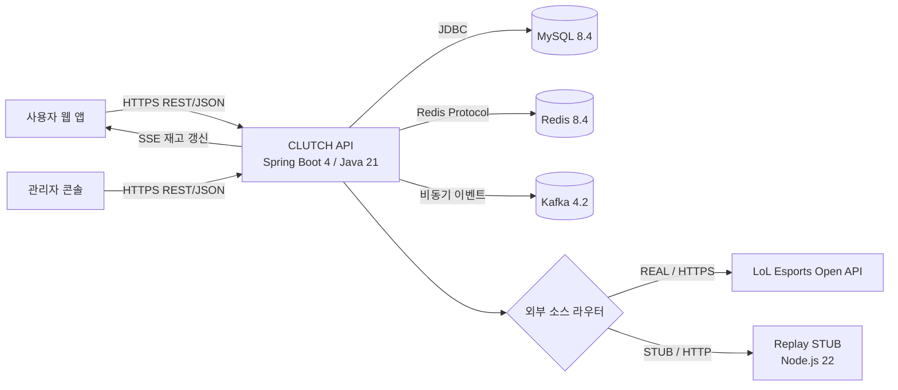
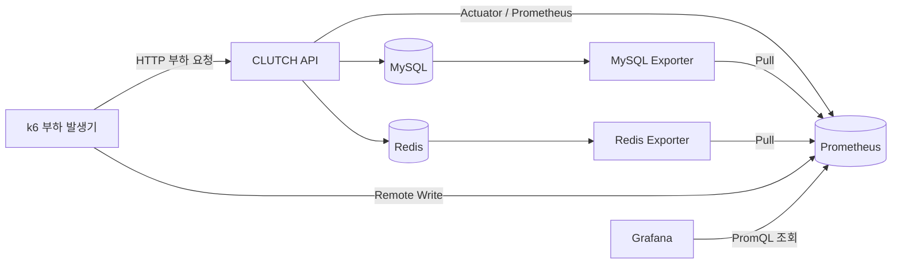

# CLUTCH 시스템 및 패키지 아키텍처

## 범위

이 문서는 CLUTCH 백엔드의 현재 시스템 구성, 모듈 책임, 패키지 계층과 주요 데이터 흐름을
정의한다. 새로운 코드를 추가하거나 기존 코드를 수정할 때는 기능이 속한 모듈과 계층을 이
문서를 기준으로 결정한다.

세부 비즈니스 규칙은 `docs/02-domain/`, 기술 선택의 배경은 `docs/03-decisions/`, 외부에 공개하는 상세
계약은 `docs/02-domain/api/`에서 관리한다. 이 문서는 각 도메인의 세부 규칙을 중복해서 설명하지 않는다.

## 아키텍처 원칙

- 백엔드는 Spring Boot 4와 Java 21로 구성한 **모듈형 모놀리스**다.
- 모든 백엔드 모듈은 하나의 애플리케이션과 JVM에서 실행하고 함께 배포한다.
- 코드는 최상위 기능 패키지로 먼저 나누고, 각 기능 안에서 API, 서비스, 도메인과 데이터 접근
  책임을 분리한다.
- MySQL은 영속 데이터의 최종 기준 저장소이며 Flyway로 스키마를 관리한다.
- Redis는 세션, 고빈도 상태와 원자적 동시성 제어에 사용한다. 영속 데이터의 최종 기준으로
  간주하지 않는다.
- Kafka는 비동기 후속 전달에 사용한다. 현재 쿠폰의 최종 발급 성공은 Kafka 소비가 아니라
  MySQL의 `user_coupon` 생성으로 판단한다.
- 외부 LoL Esports API와 Replay STUB은 애플리케이션 내부 라우터 뒤에 두어, 도메인 서비스가
  데이터 소스별 HTTP 처리 방식에 직접 의존하지 않게 한다.

## 전체 시스템 구성



사용자 웹 앱과 관리자 콘솔은 별도 프론트엔드 애플리케이션이다. 백엔드는 REST/JSON API를
기본 통신 방식으로 사용하고, 쿠폰 잔여 재고처럼 서버가 변경을 즉시 알려야 하는 기능에는
SSE를 사용한다.

현재 기준 실행 환경은 단일 애플리케이션과 단일 MySQL·Redis·Kafka 구성을 기본으로 한다.
일부 기능은 다중 애플리케이션 인스턴스를 고려하지만, 실제 확장 범위와 제약은 각 도메인
문서와 ADR에 명시한다.

## 최상위 모듈

소스 루트는 `src/main/java/com/clutch`이며 기능 중심으로 다음과 같이 나눈다.

| 패키지 | 책임 |
|---|---|
| `lolesports` | 외부 경기 API 연동, 일정·순위·라이브 경기 수집, 캐시, 경기·세트 결과 저장과 외부 소스 라우팅 |
| `betting` | 세트 승패 배팅 이벤트 생성, 배팅 등록, 포인트 차감, 결과 확정, 정산과 환불 |
| `watch` | 시청 세션, heartbeat, 유효 시청 시간 누적과 포인트 수령 |
| `coupon` | 쿠폰 종류와 이벤트 정의, 트리거, 발급 요청, Redis 재고, 발급 복구와 결과 Outbox |
| `wallet` | 실제 사용자 쿠폰 생성·조회·사용·취소와 지갑 Outbox |
| `user` | 사용자 계정, 역할, 프로필과 현재 포인트 조회 |
| `replay` | 애플리케이션에서 Replay STUB의 시작, 속도와 상태를 제어하는 운영 API |
| `common` | 특정 도메인에 속하지 않는 최소한의 공통 기능 |

최상위 모듈은 배포 단위가 아니라 논리적 경계다. 모든 모듈은 하나의 Spring Boot
애플리케이션으로 빌드되지만, 기능 책임과 변경 영향을 구분하기 위해 패키지 경계를 유지한다.

### 쿠폰 하위 모듈

쿠폰은 책임 범위가 넓어 다음 하위 패키지로 다시 나눈다.

| 패키지 | 책임 |
|---|---|
| `coupon.type` | 재사용 가능한 쿠폰 혜택 종류와 상태 관리 |
| `coupon.event` | 쿠폰 이벤트, 항목, 단계와 회차 정의 |
| `coupon.claim` | 발급 요청, Redis 재고 차감, 동기 발급 흐름, SSE, Outbox와 장애 복구 |
| `coupon.contract` | 쿠폰과 다른 모듈 사이에서 사용하는 발급·트리거·Kafka 계약 |
| `coupon.test` | 운영자가 재현 가능한 테스트 이벤트와 경기 트리거를 실행하는 보조 기능 |

`coupon.claim`은 Redis에서 재고와 중복을 먼저 원자적으로 판단한 뒤 `coupon.contract.issuance`
계약으로 `wallet`의 실제 쿠폰 생성 기능을 호출한다. 쿠폰 발급의 상세 정합성 규칙은
`docs/02-domain/coupon.md`를 따른다.

## 모듈 내부 계층

모든 모듈이 완전히 같은 폴더 이름을 사용하지는 않지만 책임은 다음 계층으로 구분한다.

```text
API 또는 Web
    ↓
Service
    ↓
Domain / Entity
    ↓
Repository
```

### API 계층

대표 패키지는 `api`, `web`과 그 아래의 요청·응답 DTO다.

- HTTP 요청 수신, 입력 검증, 인증된 사용자 식별자 해석과 HTTP 응답 생성을 담당한다.
- 유스케이스는 Service에 위임한다.
- 비즈니스 판단, 집계, 트랜잭션과 데이터 조회 전략을 새로 작성하지 않는다.
- JPA Entity를 직접 반환하지 않고 응답 DTO로 변환한다.
- 도메인 예외를 HTTP 상태와 오류 응답으로 바꾸는 예외 처리기를 둔다.

### Service 계층

대표 패키지는 `service`다.

- 한 유스케이스의 실행 순서와 트랜잭션 경계를 담당한다.
- Domain 객체와 Repository를 조합하고 외부 포트나 인프라 어댑터를 호출한다.
- 여러 모듈의 기능이 필요하면 공개된 계약을 우선 사용한다.
- 데이터 정합성에 필요한 잠금, 멱등성, 보상과 장애 전환 흐름을 조정한다.

### Domain 계층

대표 패키지는 `domain`이며 `lolesports`의 영속 모델은 현재 `entity` 패키지를 사용한다.

- 상태, 값과 상태 전이 같은 핵심 규칙을 표현한다.
- 유효하지 않은 상태 전이를 스스로 거부한다.
- Controller, HTTP DTO와 외부 API 응답 형식에 의존하지 않는다.
- 영속화 기술에 필요한 JPA 매핑은 포함할 수 있지만, 조회 전략과 유스케이스 흐름은 맡지 않는다.

### Repository 계층

대표 패키지는 `repository`다.

- JPA Repository, 명시적 조회 쿼리와 데이터 접근 구현을 둔다.
- 데이터 조회와 저장만 담당하고 HTTP 응답이나 유스케이스 흐름을 만들지 않는다.
- 동시성 제어에 필요한 행 잠금과 조건부 갱신은 Repository 계약으로 노출한다.

### 인프라 어댑터

| 패키지 | 책임 |
|---|---|
| `client` | 외부 HTTP API 호출과 외부 응답 수신 |
| `source`, `live` | 외부 소스 선택과 라이브 데이터를 도메인 입력으로 변환 |
| `redis` | Redis 키, Lua script 실행과 Redis 상태 변환 |
| `kafka`, `outbox` | Kafka 발행·소비와 Outbox 저장·재시도 |
| `scheduler`, `listener` | 주기 작업과 외부·인프라 이벤트 수신 |
| `config` | Spring Bean과 설정 속성 구성 |

Scheduler와 Listener는 진입점 역할만 하고 실제 업무 처리는 Service에 위임한다.

## 모듈 간 의존 규칙

- 모듈 간에 이미 정의된 `contract` 또는 인터페이스가 있으면 구체 구현 대신 계약에 의존한다.
- 쿠폰 발급은 `CouponIssuer`, 복구 조회는 `CouponIssuanceRecoveryReader`, 경기 트리거는
  `CouponMatchTrigger`와 `CouponTriggerPort`를 경계로 사용한다.
- 다른 모듈의 Controller나 API DTO를 내부 유스케이스에서 호출하지 않는다.
- 공통 패키지로 옮기는 것은 두 개 이상의 모듈에서 같은 기술 책임을 실제로 공유할 때만 허용한다.
- 기존 코드의 모듈 간 직접 Repository 의존을 현재 작업과 무관하게 일괄 변경하지 않는다.
  새로운 결합을 추가할 때는 먼저 작은 계약으로 분리할 수 있는지 검토한다.
- 순환 의존이 생기면 한쪽 모듈의 계약 패키지 또는 상위 유스케이스로 의존 방향을 분리한다.

## 데이터 및 메시징

### MySQL

MySQL 8.4는 사용자, 경기, 배팅, 시청 세션, 쿠폰 발급과 Outbox를 포함한 영속 데이터의
최종 기준이다.

- 스키마는 `src/main/resources/db/migration/`의 Flyway migration으로만 변경한다.
- 애플리케이션은 `ddl-auto: validate`로 Entity와 스키마를 검증한다.
- 날짜와 시각은 UTC로 저장하고 처리한다.
- 하나의 유스케이스에서 함께 성공해야 하는 변경은 같은 MySQL transaction으로 묶는다.

### Redis

Redis 8.4는 빠른 상태 조회와 원자적 동시성 제어에 사용한다.

- Spring Session 저장소: `clutch:session` namespace
- 쿠폰 재고: `coupon:event-item:{itemId}:stock`
- 쿠폰 회차 당첨자: `coupon:occurrence:{occurrenceId}:claimed-users`
- 쿠폰 발급 컨텍스트: `coupon:occurrence:{occurrenceId}:claim-context`
- 시청 세션: `watch:session:*`, `watch:alive:*`, `watch:active:*`, `watch:switch-lock:*`

쿠폰 재고와 시청 상태 변경은 Lua script로 원자적으로 처리한다. Redis 데이터가 유실되거나
정합성을 신뢰할 수 없을 때의 복구 기준은 MySQL이며, 세부 정책은 각 도메인 문서를 따른다.

### Kafka와 Outbox

Kafka 4.2는 쿠폰 후속 이벤트를 비동기로 전달한다. 현재 코드에 정의된 토픽은 다음과 같다.

| 토픽 | 역할 |
|---|---|
| `coupon.claim.accepted` | 기존 비동기 발급 경로와의 호환을 위한 쿠폰 발급 접수 이벤트 |
| `coupon.issue.result` | 실제 쿠폰 생성 결과 후속 전달 |

`coupon_claim_outbox`와 `wallet_outbox`는 Kafka 토픽이 아니라 MySQL 테이블이다. 도메인 변경과
같은 transaction에서 발행할 이벤트를 저장하고, 별도 Publisher가 Kafka 전송을 재시도한다.
시청 포인트는 현재 Kafka를 사용하지 않고 Redis Lua와 MySQL transaction으로 처리한다.

## 외부 경기 소스와 Replay

`lolesports.source`의 외부 소스 라우터는 애플리케이션 전체의 경기 데이터 소스를 `REAL` 또는
`STUB`으로 선택한다.

- `REAL`: LoL Esports Open API를 HTTPS REST/JSON으로 호출한다.
- `STUB`: Compose의 Node.js 22 Replay 서버를 HTTP REST/JSON으로 호출한다.
- 애플리케이션은 항상 `REAL` 모드로 시작한다.
- 소스 전환은 운영자 API가 명시적으로 수행하며 장애 시 자동으로 STUB으로 전환하지 않는다.
- Replay 서버는 녹화 fixture를 재생하지만, 발생한 경기·배팅·포인트·쿠폰 데이터는 실제
  애플리케이션 흐름과 MySQL을 사용한다.

상세 전환 정책은 `docs/03-decisions/001-runtime-external-source-switching.md`를 따른다.

## 모니터링과 부하 테스트



- 애플리케이션은 Spring Boot Actuator와 Micrometer로 `/actuator/prometheus` 메트릭을 노출한다.
- MySQL Exporter와 Redis Exporter가 저장소 상태를 Prometheus 형식으로 노출한다.
- Prometheus는 애플리케이션과 Exporter를 Pull 방식으로 수집하고 k6 테스트 지표는 Remote Write로
  받는다.
- Grafana는 Prometheus를 조회해 애플리케이션, MySQL, Redis와 부하 테스트 지표를 시각화한다.
- 기본 인프라와 Exporter는 루트 `compose.yaml`, Prometheus와 Grafana는 `monitoring/compose.yaml`,
  부하 시나리오는 `k6/`에서 관리한다.
- 부하 발생기와 모니터링 서버는 같은 장비에서 실행할 필요가 없다. 원격 실행 시 주소와 방화벽은
  환경 설정으로 주입하고 아키텍처 규칙에 특정 장비 주소를 고정하지 않는다.

## 현재 확장 제약

애플리케이션은 모듈형 모놀리스이므로 동일한 빌드 결과를 여러 인스턴스로 실행할 수 있지만,
현재 모든 기능이 다중 인스턴스 조정을 완료한 것은 아니다.

- 쿠폰 SSE 구독자 목록은 애플리케이션 메모리에 있으므로 인스턴스 간 알림 전달이 필요하다.
- 외부 소스 모드, 라이브 캐시와 폴링 상태는 애플리케이션 프로세스에 있으므로 여러 인스턴스가
  동시에 수집하거나 서로 다른 소스를 선택하지 않도록 조정해야 한다.
- 쿠폰 Redis 복구 상태와 실행은 현재 단일 애플리케이션 인스턴스를 기준으로 한다.
- 쿠폰 성공 수량 집계는 MySQL named lock으로 여러 인스턴스의 중복 실행을 막는다.
- MySQL, Redis와 Kafka의 고가용성 구성은 현재 로컬 Compose 기준 범위에 포함하지 않는다.

다중 인스턴스 또는 저장소 고가용성을 도입할 때는 기능별 공유 상태, 리더 선출, 이벤트 전달과
장애 복구 방식을 먼저 결정하고 별도 ADR로 기록한다.

## 변경 시 확인 사항

- 기능을 추가하기 전에 어느 최상위 모듈이 책임질지 먼저 결정한다.
- Controller에 새 비즈니스 로직이나 Repository 직접 호출을 추가하지 않는다.
- 모듈 간 호출이 필요하면 기존 계약을 재사용하거나 최소한의 새 계약을 정의한다.
- Redis 또는 Kafka를 추가할 때 MySQL 기준 데이터, 장애 시 동작과 복구 방법을 함께 정의한다.
- 스키마 변경은 Flyway migration, 설정 변경은 `application.example.yaml`, 운영 구조 변경은
  Compose와 관련 문서를 함께 확인한다.
- 중요한 저장소 선택, 동시성 제어, 메시징 또는 장애 복구 방식이 바뀌면 ADR을 추가한다.
- 구현과 이 문서가 충돌하면 임의로 문서를 현재 코드에 맞추지 말고, 의도된 규칙과 기존 구현 중
  어느 쪽을 변경할지 먼저 확인한다.

## 관련 문서

- `docs/02-domain/coupon.md`
- `docs/02-domain/watch-session.md`
- `docs/02-domain/betting.md`
- `docs/02-domain/match-set-result.md`
- `docs/04-conventions/database-convention.md`
- `docs/03-decisions/README.md`
