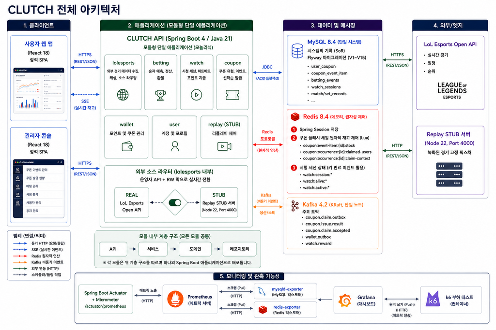

# CLUTCH 시스템 아키텍처

> 상태: 현재 구현 기준
> 목적: CLUTCH를 구성하는 시스템과 저장소, 외부 연동 및 주요 데이터 흐름을 한눈에 설명한다.

## 문서 범위

이 문서는 CLUTCH 백엔드가 어떤 시스템으로 구성되고 각 구성 요소가 어떻게 통신하는지를
설명한다. 클래스 배치와 계층 책임은 [패키지 구조](../04-conventions/package-structure.md),
비즈니스 규칙은 `02-domain/`, 중요한 기술 선택의 이유는 `03-decisions/`에서 관리한다.

## 전체 시스템 구성도

### 그림 읽는 방법

- **클라이언트**: 사용자 웹과 관리자 콘솔이 CLUTCH API를 REST/JSON으로 호출하고,
  사용자는 쿠폰 재고 변경을 SSE로 전달받는다.
- **애플리케이션**: Spring Boot 기반 모듈형 모놀리스 안에서 경기, 배팅, 시청, 쿠폰,
  지갑, 사용자와 Replay 제어 기능을 도메인별로 나눈다.
- **데이터와 메시징**: MySQL은 영속 데이터의 최종 기준이며 Redis는 세션과 원자적 상태
  제어, Kafka는 비동기 이벤트 전달에 사용한다.
- **외부 연동**: 경기 데이터는 설정에 따라 LoL Esports Open API 또는 Replay STUB에서
  가져온다.
- **모니터링과 부하 테스트**: Prometheus가 애플리케이션과 저장소 지표를 수집하고,
  Grafana가 이를 시각화하며 k6가 부하 요청과 테스트 지표를 생성한다.

### 현재 구현과 다른 표기

이 그림은 전체 흐름을 설명하기 위한 아키텍처 초안이다. 다음 표기는 현재 저장소와 다르므로
그림을 최종본으로 사용할 때 수정해야 한다.

- Flyway migration은 그림의 `V1~V15`가 아니라 현재 `V1~V22`까지 존재한다.
  `V17~V19`는 쿠폰 통계·거절 통계·정합성 검증 테이블, `V20~V21`은 사용자 포인트
  순위 인덱스, `V22`는 쿠폰 일별 발급 통계 테이블을 추가하거나 최적화한다.
- 현재 Kafka 토픽은 `coupon.claim.accepted`, `coupon.issue.result` 두 개다.
- 그림의 `coupon.claim.outbox`, `wallet.outbox`는 Kafka 토픽이 아니라 MySQL Outbox
  테이블을 의미한다.
- 그림의 `watch.reward`에 해당하는 Kafka 토픽은 현재 구현에 없다.

그림을 수정하기 전까지 세부 구현 기준은 아래 본문과 실제 코드를 따른다.

CLUTCH는 Spring Boot와 Java로 구성된 모듈형 모놀리스다. 기능은 도메인별 패키지로
분리하지만 하나의 애플리케이션과 JVM에서 실행하고 함께 배포한다. 사용자 웹과 관리자
콘솔은 REST/JSON API로 백엔드를 호출하며, 쿠폰 잔여 재고처럼 서버가 변경을 즉시 알려야
하는 기능에는 SSE를 사용한다.

## 구성 요소와 역할

| 구성 요소 | 역할 | 주요 통신 방식 |
|---|---|---|
| 사용자 웹 앱 | 경기 조회, 시청, 배팅, 쿠폰 발급 등 사용자 기능 제공 | HTTPS REST/JSON, SSE |
| 관리자 콘솔 | 쿠폰·배팅·경기 데이터 관리와 운영 기능 제공 | HTTPS REST/JSON |
| CLUTCH API | 유스케이스 실행, 도메인 규칙 적용, 트랜잭션과 외부 연동 조정 | JDBC, Redis Protocol, Kafka, HTTP |
| MySQL | 사용자, 경기, 배팅, 포인트, 쿠폰과 Outbox를 저장하는 최종 기준 저장소 | JDBC |
| Redis | 세션과 고빈도 상태 저장, 쿠폰 재고·중복 발급 및 시청 상태의 원자적 제어 | Redis Protocol, Lua script |
| Kafka | 쿠폰 발급 결과 등 즉시 응답과 분리할 수 있는 후속 이벤트 전달 | Kafka Protocol |
| LoL Esports Open API | 실제 경기 일정, 순위, 라이브 경기와 결과 데이터 제공 | HTTPS REST/JSON |
| Replay STUB | 녹화된 경기 데이터를 재생하여 외부 API 없이 시연과 테스트 지원 | HTTP REST/JSON |
| Prometheus | 애플리케이션, MySQL, Redis와 부하 테스트 지표 수집·저장 | HTTP Pull, Remote Write |
| Grafana | Prometheus 지표 조회와 대시보드 시각화 | PromQL |
| k6 | 실제 HTTP 요청을 발생시키고 부하 테스트 지표 생성 | HTTP, Prometheus Remote Write |

## 애플리케이션 내부 기능

CLUTCH API는 하나의 배포 단위지만 다음 기능 영역으로 나뉜다.

| 기능 영역 | 책임 |
|---|---|
| 경기(`lolesports`) | 외부 경기 데이터 수집, 경기·세트 결과 저장과 외부 소스 선택 |
| 배팅(`betting`) | 세트 승패 배팅 접수, 포인트 차감, 결과 확정과 정산 |
| 시청(`watch`) | 시청 세션과 heartbeat, 유효 시청 시간 누적과 포인트 지급 |
| 쿠폰(`coupon`) | 쿠폰 종류·이벤트·회차, 발급 요청, Redis 재고, SSE와 장애 복구 |
| 지갑(`wallet`) | 사용자 쿠폰 생성·조회·사용·취소와 지갑 Outbox |
| 사용자(`user`) | 사용자 계정, 역할, 프로필과 포인트 조회 |
| Replay 제어(`replay`) | Replay STUB 시작, 재생 속도와 상태를 제어하는 운영 기능 |
| 공통(`common`) | 여러 기능에서 실제로 공유하는 최소 공통 기능 |

각 영역은 물리적으로 분리된 서비스가 아니라 하나의 애플리케이션 안에 존재하는 논리적
경계다. 영역별 세부 패키지와 계층 규칙은 컨벤션 문서에서 설명한다.

## 핵심 처리 흐름

### 경기 데이터 수집

1. 외부 소스 라우터가 현재 설정에 따라 실제 LoL Esports API 또는 Replay STUB을 선택한다.
2. 경기 모듈이 외부 응답을 내부 데이터 형식으로 변환한다.
3. 경기 일정, 진행 상태와 세트 결과를 MySQL에 저장한다.
4. 저장된 경기 데이터는 사용자 화면, 배팅, 시청과 쿠폰 트리거에서 사용한다.

### 쿠폰 발급

1. 경기 이벤트 또는 관리자 동작으로 쿠폰 발급 회차가 열린다.
2. 사용자가 쿠폰을 요청하면 Redis Lua script가 재고와 사용자 중복을 원자적으로 확인한다.
3. Redis에서 발급 가능하다고 판단된 요청은 MySQL transaction에서 발급 요청과 실제 사용자
   쿠폰을 저장한다.
4. 실제 사용자 쿠폰 생성까지 완료된 경우에만 최종 발급 성공으로 판단한다.
5. 후속 이벤트는 MySQL Outbox에 함께 저장하고 별도 Publisher가 Kafka로 전달한다.
6. 잔여 재고 변경은 SSE를 통해 구독 중인 사용자 화면에 전달한다.

Redis는 빠른 재고 제어에 사용하지만 최종 발급 사실의 기준은 MySQL이다. Redis 데이터가
유실되거나 신뢰할 수 없는 상태가 되면 MySQL의 실제 발급 결과를 기준으로 재고를 재구축한다.

### 배팅과 포인트

1. 배팅 모듈이 경기와 세트 진행 상태를 기준으로 배팅 가능 여부를 판단한다.
2. 사용자가 배팅하면 포인트 차감과 배팅 기록을 하나의 MySQL transaction으로 처리한다.
3. 세트 결과가 확정되면 적중 여부를 계산하고 정산 결과를 포인트에 반영한다.

### 시청 포인트

1. 사용자 입장과 heartbeat를 기준으로 Redis에 활성 시청 세션과 유효 시청 시간을 기록한다.
2. 누적 시간이 지급 조건을 만족하면 사용자가 포인트 수령을 요청한다.
3. 중복 수령 방지는 Redis Lua script로 처리하고 최종 포인트 거래는 MySQL에 저장한다.

### 모니터링과 부하 테스트

1. CLUTCH API는 Actuator와 Micrometer를 통해 Prometheus 형식의 메트릭을 노출한다.
2. MySQL Exporter와 Redis Exporter가 각 저장소 상태를 메트릭으로 변환한다.
3. Prometheus가 애플리케이션과 Exporter의 지표를 Pull 방식으로 수집한다.
4. k6는 부하 요청을 발생시키고 테스트 지표를 Prometheus에 Remote Write한다.
5. Grafana가 Prometheus를 조회해 애플리케이션과 저장소, 부하 테스트 지표를 시각화한다.

## 데이터와 메시징 기준

### MySQL

- 영속 데이터의 최종 기준 저장소다.
- 사용자, 경기, 배팅, 포인트, 쿠폰과 Outbox 데이터를 저장한다.
- 스키마는 Flyway migration으로 관리하고 애플리케이션은 `ddl-auto: validate`를 사용한다.
- 함께 성공하거나 실패해야 하는 변경은 같은 transaction으로 처리한다.

### Redis

- Spring Session, 쿠폰 재고와 중복 발급 제어, 시청 상태처럼 빠른 접근이 필요한 데이터에 사용한다.
- 여러 값을 한 번에 확인하고 변경해야 하는 작업은 Lua script로 원자적으로 처리한다.
- 영속 데이터의 최종 기준으로 사용하지 않으며 장애 복구 기준은 MySQL이다.

### Kafka와 Outbox

- Kafka는 요청 응답과 분리 가능한 후속 이벤트를 비동기로 전달한다.
- 현재 주요 이벤트는 쿠폰 발급 접수와 실제 쿠폰 생성 결과다.
- Outbox는 Kafka 토픽이 아니라 MySQL 테이블이며, 도메인 변경과 발행할 이벤트를 같은
  transaction에 저장한다.
- 별도 Publisher가 저장된 Outbox를 Kafka로 전송하고 실패 시 재시도한다.

## 실제 경기 소스와 Replay

경기 데이터 소스는 애플리케이션 내부 라우터를 통해 `REAL` 또는 `STUB`으로 선택한다.

- `REAL`은 LoL Esports Open API를 호출한다.
- `STUB`은 Node.js Replay 서버에 저장된 fixture를 재생한다.
- 애플리케이션은 기본적으로 `REAL` 모드로 시작한다.
- 운영자가 API를 통해 명시적으로 전환하며 외부 API 장애만으로 자동 전환하지 않는다.
- STUB 모드에서도 배팅, 포인트, 쿠폰 처리는 실제 애플리케이션과 저장소를 사용한다.

자세한 전환 정책은
[운영자 제어형 외부 데이터 소스 전환](../03-decisions/008-runtime-external-source-switching.md)을 따른다.

## 실행 구성

로컬 개발과 시연 환경은 Docker Compose를 기준으로 한다.

- 기본 `compose.yaml`은 MySQL, Redis, Kafka, Replay STUB과 Exporter를 실행한다.
- Spring Boot 애플리케이션은 로컬 JVM 또는 Compose의 `app` profile로 실행할 수 있다.
- Prometheus와 Grafana는 `monitoring/compose.yaml`에서 실행한다.
- 부하 테스트 시나리오와 실행 스크립트는 `k6/`에서 관리한다.

## 현재 범위와 제약

- 기본 구성은 하나의 CLUTCH API 인스턴스와 단일 MySQL·Redis·Kafka를 전제로 한다.
- MySQL, Redis와 Kafka의 고가용성 구성은 현재 프로젝트 범위에 포함하지 않는다.
- 쿠폰 SSE 구독자와 일부 외부 경기 수집 상태는 애플리케이션 메모리에 있어 다중 인스턴스
  환경에서는 별도 상태 공유와 이벤트 전달 방식이 필요하다.
- 일부 기능은 다중 인스턴스 실행을 고려했지만 전체 기능의 수평 확장을 보장하지 않는다.
- 새로운 저장소, 메시징 또는 장애 복구 방식을 도입할 때는 최종 기준 데이터와 장애 시 동작을
  먼저 결정하고 필요한 경우 ADR을 작성한다.

## 관련 문서

- [과제 요구사항](../00-project/requirements.md)
- [쿠폰 도메인 규칙](../02-domain/coupon.md)
- [시청 세션과 포인트 지급 규칙](../02-domain/watch.md)
- [승패 배팅 규칙](../02-domain/betting.md)
- [매치·세트 결과 데이터 계약](../02-domain/lolesports.md)
- [기술 결정 기록](../03-decisions/README.md)
- [패키지 구조](../04-conventions/package-structure.md)
- [데이터베이스 규칙](../04-conventions/database-convention.md)
- [Redis 쿠폰 재고 장애 복구](../06-operations/coupon-redis-recovery.md)
